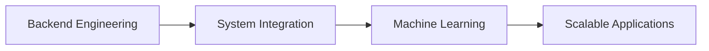

<div align="center">

# Hi, I'm Ayudya 👋

### IT Student • Backend Developer • Mobile Developer


</div>

---

## 🚀 About Me

```txt
Name        : Ayu Dyanandira
Role        : Information Technology Student
Focus       : Backend Development & System Integration
Currently   : Building Financial Recommendation Systems
Location    : Indonesia
```

I enjoy turning ideas into working software, especially when it involves APIs, databases, mobile applications, and connecting multiple systems together.

---

## 🛠 Tech Stack

<p align="center">

</p>

---

## 📂 Featured Projects

### 💰 Financial Recommendation System

A recommendation engine that analyzes user behavior and spending patterns to generate personalized financial insights.

**Stack:** Node.js • PostgreSQL • Machine Learning

---

### 🛒 Inventory Management System

Integrated warehouse and cashier platform with real-time stock synchronization.

**Stack:** Lumen • PostgreSQL • REST API

---

### 📱 Android Contact Manager

Authentication, contact management, and cloud synchronization.

**Stack:** Android Java • Firebase

---

### 🔐 Cryptography Toolkit

Collection of classical cryptography implementations and attack simulations.

**Stack:** Python

---

## 📊 GitHub Analytics

<p align="center">


</p>

<p align="center">

</p>

---

## 🌱 Current Focus



---

## ☕ Fun Facts

- I can spend 5 hours debugging a problem caused by a missing semicolon.
- My projects usually start with *"this should be simple"*.
- PostgreSQL has become my comfort database.
- The best feeling is when the API returns `200 OK`.

---

## 📫 Connect

GitHub: github.com/ayudyanandira

> Building solutions, learning continuously, and shipping projects one commit at a time.
